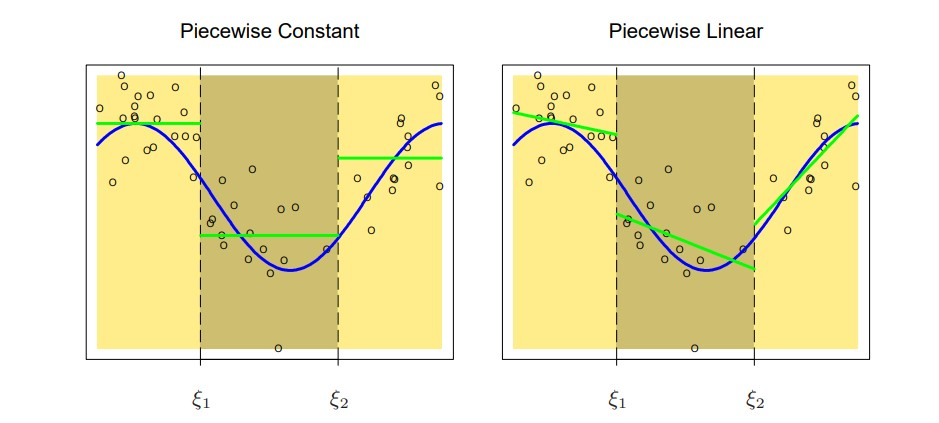
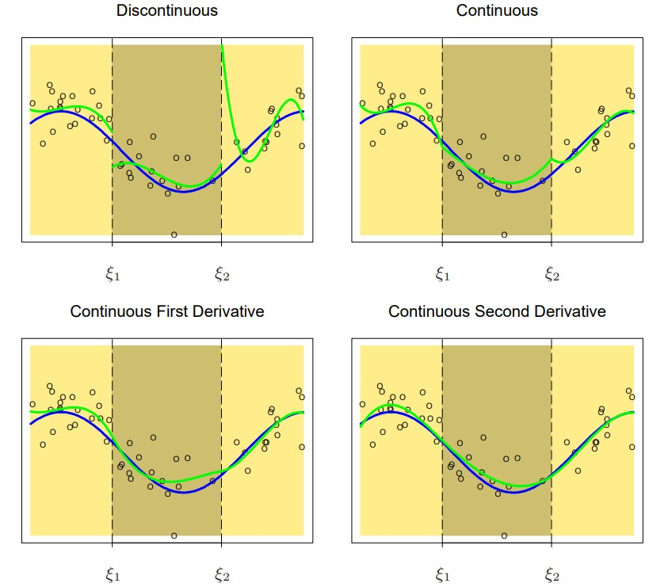
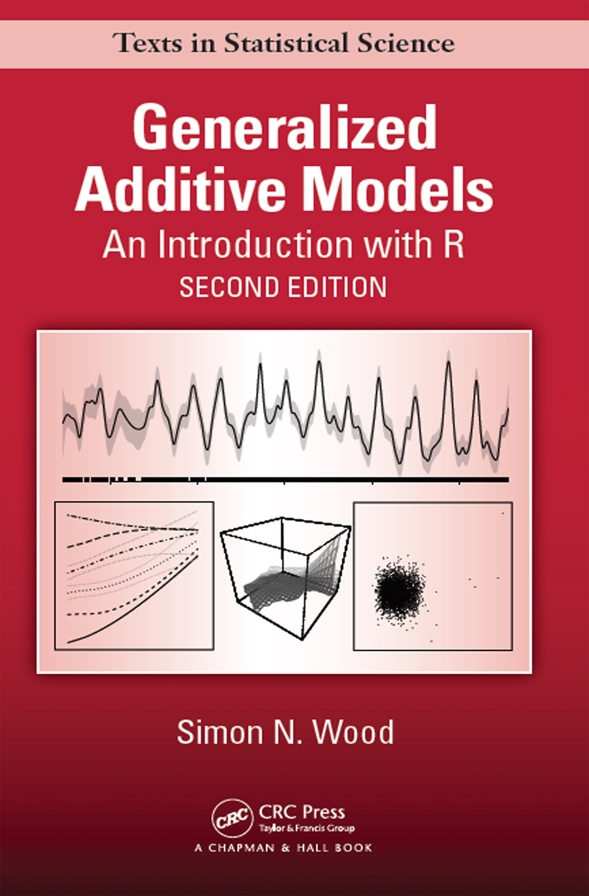

```{r setup, include=FALSE}
knitr::opts_chunk$set(echo = TRUE)
library(tidyverse)
library(ggpubr)
library(viridis)
```

# Who Am I?

 - 4th-year Ph.D. student in BST @ UAB
 
 - Dissertation: Bayesian high-dimensional additive models
 
 - Background:
 
    - Balanced methodology & collaboration
    
    - Experienced R programmer & package creator
    
- Graduate in about 1 year, Looking for
    
    - Faculty postion in Biostat
    
    - Post-doc in methodology dev. on HD, causal inference

<!-- Enough commercial and self promotion, lets get to the topic-->

# Overview
* Understanding
  * Spline Concepts
  * Regression Splines
  
* Application
  * Non-linear Effect Modifier
  * Non-proportional Hazard Models
  * Generalized Additive Mixed Model
  
* Beyond
  * Spline Surface
  * Smoothing Splines
  * Function Selection in High Dimension

# Objectives
* To review the basic concepts of spline

* To raise awareness of advanced spline applications 

<!-- Plan analysis accordingly -->

Disclaimer
  
* Minimum level of theoretical justification

* No discussion on model fitting algorithms or software implementations


<!-- primarily R user, Hence, less familiar of spline implementation in other software -->

# Understanding

## Motivation
> "It is extremely unlikely that the true (effect) function f(X) (_on the outcome_) is actually linear in X."

\hspace*{2cm}

> --- @hastie2009elements PP. 139

<!-- For example, the relationship between age and COVID mortality. -->

## Previous Solutions:

* Variable categorization: e.g. using quartiles of a continuous variable in a model

  * Assume all subjects within a group shares the same risk/effect
  * Loss of data fidelity
  
* Polynomial regression:
  $$
  y = \beta_0 + \beta_1X + \beta_2 X^2 + \dots + \beta_mX^m + \epsilon
  $$
  * Precision issues, e.g. $X$ is blood pressure measure, and $X^3$ would be extremely large
  * Goodness of fit: deciding which order of polynomial term should be included

## Spline
* A spline is a piece-wise function where each piece is a polynomial function of order $m$

* A.k.a. non-parametric regression, semi-parametric regression, (generalized) additive model

* Can be easily incorporated in linear regression, generalized linear regression, Cox regression, as __regression splines__

## Spline Components

* Order/degree of the polynomial function, $m$

  * Normally, $m=3$, i.e. cubic spline is sufficient

* An increasing breakpoints sequence $\tau$
  * a.k.a. knots, where the piece-wise functions joint
  * e.g. $k \equiv |\tau| = 5$, equally spaced

* Continuity conditions at knots, $v$
  * to control the smoothness between pieces
  * e.g. continuous at second derivative for cubic spline


## Toy Example

A spline function of the variable $X$, $f(X)$, of order $m=0$ with $k=2$ knots ($\tau_1 = 1, \tau_2 = 5$) and no continuity condition

\begin{equation*}
  f(X) = 
  \begin{cases}
  2, & X \leq 1 \\
  1.2, & 1 < X \leq 5\\
  1.5, & X > 5
  \end{cases}
\end{equation*}
  <!-- This is the business of column space force, aka linear algebra mathematicians. -->

## Visual Demonstration

{height=80%}
Figure from @hastie2009elements PP.142

## Cubic Spline
* Cubic polynomial in each piece-wise function, i.e. m = 3

  * E.g. truncated power bases with 3 knots at $\tau_1, \tau_2, \tau_3$
\begin{align*}
f(X) &= \beta_0 + \beta_1 X+\beta_2 X^2 + \beta_3 X^3 + \beta_4(X-\tau_1)^3_+\\
& +  \beta_5(X-\tau_2)^3_+ + \beta_6(X-\tau_3)^3_+\\
&= \boldsymbol \beta^T \bm B(X)
\end{align*}


* Continuous at second derivative

  * The smoothest possible interpolant
  
* Alternative representation
  * B-spline bases for stable computation
  
* Natural cubic spline for linearity beyond boundary knots ($f^{'''}(X) = 0$)
  

  
## Cubic Spline
```{r, echo=FALSE, out.height="75%", fig.align='center'}

```
Figure from @hastie2009elements PP.143

## Regression Splines

Given the matrix form of the spline function $f(X) = \bm \beta^T \bm B(X)$,

* Linear regression: 
$$y_i \sim N(\bm \beta^T \bm B(X_i) + \bm \beta_{cov}^T \bm Z_i, \sigma^2)$$
* Generalized linear regression: 
$$E(y_i) = g^{-1}(\bm \beta^T \bm B(X_i) + \bm \beta_{cov}^T \bm Z_i), Y_i \sim EF$$
* Cox regression:
$$h(t_i) = h_0(t_i) exp(\bm \beta^T \bm B(X_i) + \bm \beta_{cov}^T \bm Z_i)$$

Model fitting and diagnostic remain the same

## Software Implementation
Two-step procedure

* Create the 'design' matrix of the spline function $B(X)$
* Fit the preferred model including $B(X)$ as covariates / predictors

```{r eval=FALSE}
library(splines)  # Package for b-spline

x_spline <- bs(x, degree = 3, # cubic polynomial
               df = 8)   # 5 (df-degree) knots         
glm(y ~ x_spline) # Fitting the spline model

# Equivalently
glm(y ~ bs(x, degree=3, df=8))
```

## Variability Band

* A delicate statistical problem
  * Confidence about spline functions VS point estimates

* Most commonly used: 95% point-wise confidence interval

* Can be calculate using statistical contrasts for regression splines

## Hypothesis Testing

* Two hypothesis tests

  * If the non-linear terms are necessary:
  $$
    H_0: \beta_2 = \beta_3 = \dots = 0
  $$
  * If the variable is necessary in the model
  $$
    H_0: f(x) = 0
  $$

* Be careful when reading program manual

## Rule of Thumb
* Cubic splines for smooth interpolant
  * B-spline for computation stability
  * 3-5 equally spaced knots 

* Transform variables with extreme values for computational stability
  * e.g. prefer $f(\log(X))$ over $f(X)$ when modeling CRP 

* Examine outlier's effect on statistically significant non-linear relationship
  
* Survival Model
  * Knots are decided by equal number of events in each group
  * Defer to @Sleeper1990 for practical guidance
  
  <!-- Insert jokes about rule of thumb -->

# Application

## Varying Coefficient

To model a non-constant effect of the variable $Z$ as a function of another variable $X$

$$
 E(y) = f(X) Z,
$$
where $f(X)$ is the varying coefficient of Z

* Example: statistical interaction $\beta XZ$ where $f(X) = \beta X$

* What if the slope of the effect are not constant across the domain of $X$?


## Non-linear Effect Modification
```{r echo=F, fig.align='center', out.height="80%"}

dat <- data.frame(
  X = rep(seq(1, 3, length.out=100), 2),
  Z = c(rep(0,100),rep(1,100)) %>% factor
) %>% 
  mutate(
    y_ln = 1+0.3*(as.numeric(Z)-1)  + 0.5*X*(as.numeric(Z)-1),
    y_sp = 1+0.3*(as.numeric(Z)-1)  + 0.5*X*(as.numeric(Z)-1) + 0.3*sin(10*X)*(as.numeric(Z)-1)
  )


ggarrange(
  ggplot(dat) +
    geom_line(aes(x = X, y=y_ln, color = Z, group = Z), size = 1)+
    ylim(0,3)+
    theme_pubclean() +
    scale_color_viridis(discrete=TRUE, option = "D"),
  ggplot(dat) +
    geom_line(aes(x = X, y=y_sp, color = Z, group = Z), size = 1)+
    ylim(0,3)+
    scale_color_viridis(discrete=TRUE, option = "D")+
          theme_pubclean(),
  common.legend = TRUE,
  legend = "bottom"
)

```

## Non-linear Effect Modification
$$
E(y) = f(X) + f^\prime(X)Z = \beta_{Z=0}^T B(X) + \beta_{Z=1}^TB(X)*Z
$$

* $f(X)$ models the effect of $X$ when $Z=0$
* $f^\prime(X)Z$ models the modifying effect of $Z$ at different values of $X$
* $f^\prime(X)$ is the varying coefficient of $Z$, using a non-linear function, for non-constant slope.


## Non-linear Effect Modification
* Assumptions of consideration
  * Should $f(X)$ be linear or non-linear?
  * Should $f(X)$ use the same bases as $f^\prime(X)$?
  * Should $f(X)$ be the same level of complexity as  $f^\prime(X)$?
      
## Non-proportional Hazard
* Cox PH model assumes proportional hazards, i.e. the hazard/effect of a variable $Z$ is independent to time

* Using Time-varying coefficients to model the non-proportional hazards
$$
  h(t) = h_0(t)exp(f(t)X) 
$$

* Defer to @Gray1992 and references therein

## Mixed Model
To model the non-linear fixed effect while considering random effects

* Good for longitudinal studies or multi-center studies
* Easy to implement: to include your design matrix of $f(X)$ in the fixed effect
* `gamm` in  R-package `mgcv`

  
# Beyond

## Spline Surface

* Model the non-linear interaction between two continuous variables

* Thin-plate splines, tensor product splines
  * Thin-plate spline is scale-sensitive
    * Recommended when variables are on the same scale
  * Tensor product spline is scale-invariant

* Dealing with _overly smoothing across boundary_
  * Soap film smoothing

* Application: 
  * Loop, M. S., Howard, G., de Los Campos, G., Al-Hamdan, M. Z., Safford, M. M., Levitan, E. B., & McClure, L. A. (2017). Heat maps of hypertension, diabetes mellitus, and smoking in the continental United States. __Circulation: Cardiovascular Quality and Outcomes, 10(1), e003350.__


## Smoothing Spline
* Motivation: 
   * To simplify the decision making about the knots

* Idea: 
  * Set the number of knots to a really large value (k=25, 40, $N$)
  * Use variable selection methods, penalized models specifically, to decide the smoothness of the spline


## Objective Functions
Given a spline model $y \sim N(f(X), \sigma^2)$

* Regression spline
$$
\text{arg}\min\limits_{\bm \beta} \sum\limits^n_{i=1} \{y_i - \beta^T B(X_i)\}^2
$$

* Smoothing spline
$$
\text{arg}\min\limits_{\bm \beta} \sum\limits^n_{i=1} \{y_i - \beta^T B(X_i)\}^2 + \lambda \int f^{''}(X)^2dx
$$

* $\lambda$ is a tuning predictor, selected via (generalized) cross-validation

## Statistical Complications
* Estimated degree of freedom due to shrinkage
  * Harder to conduct hypothesis testing, and calculate CI
  
* More decisions when modeling effect modification
  * Same smoothness for the spline functions?
  * If the same, how to estimate the smoothness

## Function Selection
* Question of interest
  * If a variable $X_i$ has effect on the outcome $Y$
  * High-dimensional data analysis, e.g. EHR, Genomics

* Solutions
  * Step-wise function selection
    * Locally optimal solution
    * Not feasible for high-dimensional analysis
  * Group penalized models
    * Biased estimation
    * Global penalization vs local penalization
  * Bayesian Hierarchical models
    * Robust estimation
    * Slow...

# Conclusion
* Reviewed concepts of spline

* New insight of advanced spline models

* Same set of variables can lead to many models with different assumptions
  * Fit many models and compare
  * Explore the inconsistency
  
* Balance between interpolation and prediction
  * "Black box" models for improved prediction

* __Consult with statisticians when not comfortable dealing spline models__

## Great Book
::: columns

:::: column
Wood, S. N. (2017). Generalized additive models: an introduction with R. CRC press.

* Chapter 7 for examples
::::

:::: column

{height=70%}

::::

:::

# Q & A

# Reference